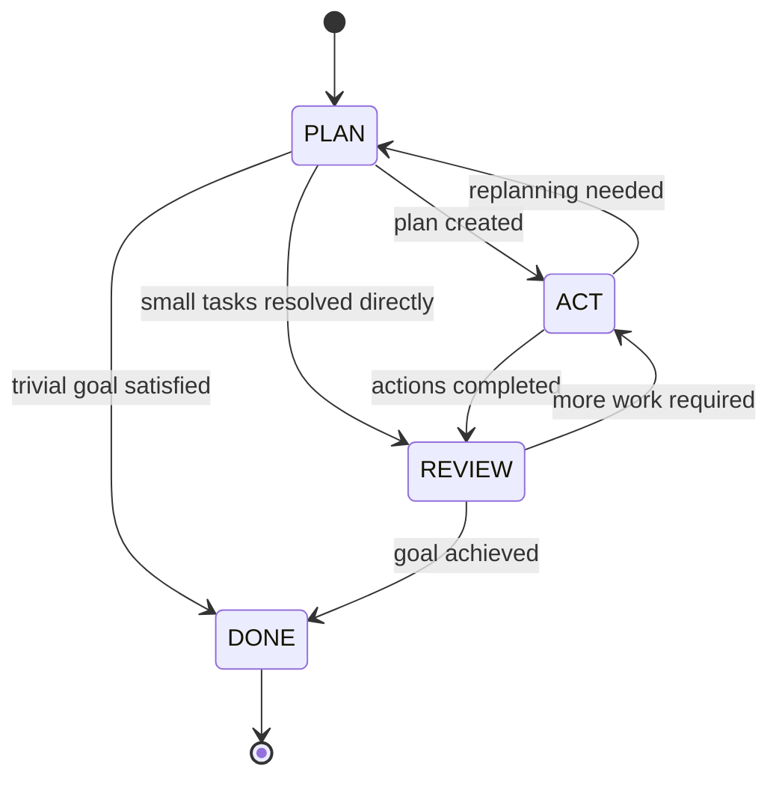

Your task is to **replace the current naive LLM integration for “Agent Mode”** with a **structured agent engine** based on a clear protocol and types, while **leaving the existing “Ask Mode” intact and functional**.

You must focus on:

- Clean separation of concerns.
- Stable protocols and type definitions.
- A small but robust state machine for the agent loop.
- Future portability to Rust (so types and protocols must be explicit and language-agnostic).

Do **not** rewrite or break the current Ask Mode behavior or UI. Implement Agent Mode as a separate, well-defined path that can coexist with Ask Mode.

---

## 1. Context and high-level goal

Parlanchina currently has:

- An **Ask Mode**: a simple “send prompt → get reply” interaction with an LLM. This **must stay intact**.
- An **Agent Mode**: currently implemented with naive LLM calls without proper structure.

You must design and implement a **generic agent engine** for Agent Mode with:

- A deterministic orchestrator loop.
- A strict JSON protocol for LLM input/output.
- A pluggable tool system (MCP tools, local tools, filesystem tools).
- A small, explicit mode/state machine: `PLAN`, `ACT`, `REVIEW`, `DONE`.
- A minimal memory abstraction that can later map to a vector DB or MCP-based memory.

The implementation should be in **Python** (to match the existing Parlanchina codebase), but all core protocols and types must be designed in a way that makes later porting to **Rust** straightforward.

---

## 2. Architecture overview

Implement the following conceptual components:

- `AgentEngine` — main orchestration loop for Agent Mode.
- `AgentProfile` — configuration object for an agent profile (prompts, tools, limits).
- `AgentState` — serializable state that survives between loop iterations.
- `LLMBackend` — abstraction over the LLM provider (OpenAI, local, etc.).
- `ToolRegistry` — registry and invoker of tools, including MCP tools.
- `Tool` — typed interface for individual tools (filesystem, MCP, HTTP, etc.).
- `MemoryLayer` — facade over working memory, semantic memory (RAG), and episodic memory.

These components should be separated into clearly named modules / files so that a future Rust implementation can mirror the same structure and protocols.

### 2.1 Mermaid component diagram

Include this Mermaid diagram (strict syntax) in the relevant documentation / comments to document the design:

```mermaid
graph TD
  User[User] -->|Task request| AgentEngine

  subgraph AgentEngine
    AE[AgentEngine<br/>main loop]
    PROF[AgentProfile]
    STATE[AgentState]
    REG[ToolRegistry]
    MEM[MemoryLayer]
    LLM[LLMBackend]
  end

  AE --> PROF
  AE --> STATE
  AE --> REG
  AE --> MEM
  AE --> LLM

  REG -->|invoke| Tool1[Tool: fs]
  REG -->|invoke| Tool2[Tool: mcp-kb]
  REG -->|invoke| Tool3[Tool: http]

  MEM -->|uses| Tool2
  MEM -->|uses| Tool3

  LLM -->|LLM Protocol| AE

  AE -->|Final answer| User
````

---

## 3. Core data types and protocols

Define these types as Python dataclasses or pydantic models, but design them as if they were language-agnostic message formats. They must be easily serializable to/from JSON. Avoid framework-specific magic.

### 3.1 `AgentProfile`

Configuration per agent profile (for example, “code navigator”, “repo assistant”, etc.).

Fields:

* `id: str`
* `name: str`
* `system_prompt: str`
* `tool_ids: list[str]`
* `limits`:

  * `max_steps: int`
  * `max_tokens_per_call: int`
  * `allow_destructive_tools: bool`
* `memory_packs: list[str]`
  (IDs or tags for preloaded “associative” context)

### 3.2 `AgentState`

Task-local state that persists across loop iterations. It must be serializable and easy to inspect.

Fields:

* `goal: str`
* `subgoals: list[str]`
* `mode: Literal["PLAN", "ACT", "REVIEW", "DONE"]`
* `step: int`
* `history: list[HistoryEntry]`
* `scratchpad: str`
  Short free-text summary of what matters so far.
* `metadata: dict[str, str]`
  Free-form flags/config for profile-specific behavior.

`HistoryEntry`:

* `action: LLMAction` (you can model this as a dict or a dedicated type)
* `observation: list[ToolObservation]`

You must implement JSON (de)serialization for these types to allow persistence and logging.

### 3.3 `ContextChunk`

Represents a piece of retrieved context (RAG, memory, etc.):

* `id: str`
* `source: Literal["kb", "code", "episodic"]`
* `content: str`
* `score: float`

---

## 4. LLM input/output protocol

This protocol is critical. The engine must always communicate with the LLM backend using a **strict JSON schema** that you enforce in Python.

### 4.1 LLM input envelope

Structure:

* `profile: AgentProfile` (or at least `profile_id` and resolved fields)
* `state: AgentState`
* `user_input: Optional[str]`
  Only present on the first step or when the user injects new input mid-run.
* `context_chunks: list[ContextChunk]`
  Pre-retrieved “associative” memory for this step.

You must implement a function (or method) that creates this envelope, serializes it to JSON, and passes it to the LLM backend as part of the prompt (system + assistant + tool meta as appropriate).

### 4.2 LLM output envelope

The LLM must always return JSON of the following structure:

* `mode: Literal["PLAN", "ACT", "REVIEW", "DONE"]`
* `message_to_user: Optional[str]`
* `tool_calls: list[ToolCall]`
* `update_subgoals: Optional[list[str]]`
* `update_scratchpad: Optional[str]`
* `done: bool`

`ToolCall`:

* `id: str`
  Unique per step. Used to correlate with results.
* `tool: str`
  Tool identifier as known by `ToolRegistry`.
* `args: dict[str, Any]`
  Arguments to be passed to the tool.

You must:

* Validate that the LLM output is well-formed JSON.
* Validate that `mode`, `done`, and `tool_calls` obey the expected schema.
* Reject or handle invalid outputs gracefully (e.g., fallback to a safe response or ask the LLM to correct itself).

---

## 5. Tool protocol and registry

Define a generic tool interface that works both for local tools and MCP-based tools.

### 5.1 `ToolDescriptor`

* `id: str`
* `name: str`
* `description: str`
* `input_schema: dict` (JSON Schema compatible)
* `output_schema: dict`
* `side_effect_level: Literal["none", "read", "write"]`

### 5.2 `ToolInvocation` and `ToolResult`

`ToolInvocation`:

* `id: str`
  Matches `ToolCall.id`.
* `tool_id: str`
* `args: dict[str, Any]`

`ToolResult`:

* `id: str`
* `tool_id: str`
* `success: bool`
* `output: Any`
* `error_message: Optional[str]`

### 5.3 `ToolRegistry`

Implement `ToolRegistry` with:

* `register_tool(descriptor: ToolDescriptor, impl: Callable)`
  (or a Tool class with an `invoke` method)
* `get_descriptor(tool_id: str) -> ToolDescriptor`
* `execute(invocations: list[ToolInvocation]) -> list[ToolResult]`

The registry should:

* Enforce safety policies (for example, disallow “write” tools if `allow_destructive_tools` is false for the current profile).
* Handle MCP-based tools via appropriate adapters (wrapping MCP calls into the `ToolInvocation`/`ToolResult` protocol).

---

## 6. Memory subsystem

Implement a `MemoryLayer` that provides a simplified interface over:

* Working memory (already in `AgentState` and history).
* Semantic memory (RAG over docs/code).
* Episodic memory (past tasks).

You are not required to fully implement a vector DB integration now. Build the interface so that a future implementation can plug in a real vector store or MCP-based memory.

### 6.1 `MemoryLayer` interface

Methods:

* `initial_associative_context(goal: str) -> list[ContextChunk]`
  Create an initial set of context chunks from configured “memory packs” and/or simple keyword search.
* `query_semantic(query: str) -> list[ContextChunk]`
  Placeholder for RAG — can be a stub initially.
* `query_episodic(query: str) -> list[ContextChunk]`
  Placeholder for episode-based recall.
* `store_episode(summary: str, tags: list[str]) -> None`
  Store a summary of what happened in this task.

### 6.2 Memory diagram

Include this Mermaid diagram in the documentation:

```mermaid
graph TD
  subgraph AgentEngine
    AE[AgentEngine]
    STATE[AgentState<br/>Working memory]
  end

  subgraph MemoryLayer
    MEM[MemoryLayer]
    SEM[SemanticMemory<br/>RAG index]
    EPI[EpisodicMemory<br/>task log]
  end

  AE --> STATE
  AE --> MEM

  MEM --> SEM
  MEM --> EPI

  subgraph ExternalStores
    KB[(KB / Vector DB)]
    LOG[(Episodes store)]
  end

  SEM --> KB
  EPI --> LOG
```

---

## 7. Agent loop and state machine

Implement the Agent Mode main loop as a deterministic orchestrator using the types and protocols above.

### 7.1 Sequence diagram

Use this logic and encode it in code:

```mermaid
sequenceDiagram
  participant U as User
  participant AE as AgentEngine
  participant MEM as MemoryLayer
  participant LLM as LLMBackend
  participant REG as ToolRegistry
  participant T as Tool(s)

  U->>AE: Task request
  AE->>MEM: initial_associative_context(goal)
  MEM-->>AE: ContextChunk[]

  loop Per step (bounded by max_steps)
    AE->>LLM: LLMInput(profile, state, context_chunks, user_input?)
    LLM-->>AE: LLMOutput(mode, tool_calls, updates, done)

    AE->>AE: validate LLMOutput<br/>update state (mode, subgoals, scratchpad)

    alt LLMOutput.tool_calls not empty
      AE->>REG: execute(tool_calls)
      REG->>T: invoke(args)
      T-->>REG: ToolResult
      REG-->>AE: ToolResult[]
      AE->>AE: append to history as observations
    end

    alt LLMOutput.message_to_user
      AE-->>U: partial message
    end

    alt LLMOutput.done or mode == "DONE" or step limit
      AE-->>U: final answer
      break
    end
  end
```

### 7.2 State machine

Implement the agent mode state machine as a small enum and deterministic transitions enforced by the engine, not by the LLM alone:



The LLM can propose a `mode` value, but the engine must:

* Validate the transition.
* Reject illegal transitions.
* Fall back to safe transitions if necessary (for example, force `REVIEW` then `DONE` when limits are reached).

---

## 8. Integration with existing Parlanchina modes

You must ensure that:

1. **Ask Mode remains unchanged**:

   * Do not modify the behavior, prompts, or flow for Ask Mode.
   * If necessary, factor shared logic into reusable components, but preserve the Ask Mode contract.

2. **Agent Mode uses the new engine**:

   * Replace the naive “just call LLM in a loop” implementation with the `AgentEngine`.
   * Ensure the UI/UX for Agent Mode works as before from the user’s perspective, but now powered by the agent engine.
   * If Agent Mode has specific prompts or behavior, implement them as one or more `AgentProfile`s.

3. **Configuration points**:

   * Add configuration to select which profiles are available in Agent Mode.
   * Allow simple extension: new profiles should be addable via config, not rewriting core engine code.

---

## 9. Non-functional requirements

* The implementation must be **readable**, **testable**, and **modular**.
* The protocols (LLM envelopes, Tool protocol, MemoryLayer interface) must be **documented**, preferably in a dedicated module or README with the Mermaid diagrams above.
* Where possible, avoid hard-binding to specific LLM providers. `LLMBackend` should be pluggable.
* Avoid over-engineering. Prioritize a minimal but solid implementation of:

  * Types and protocols.
  * Engine loop.
  * Wiring into Parlanchina’s existing architecture.

---

## 10. Deliverables

As the code generation agent, you must:

1. Create the core modules/classes for:

   * `AgentProfile`
   * `AgentState` (+ `HistoryEntry`, `ContextChunk`)
   * `LLMInput`/`LLMOutput` envelopes (even if implicit via helper functions)
   * `ToolDescriptor`, `ToolInvocation`, `ToolResult`, `ToolRegistry`
   * `MemoryLayer` interface (with simple stub implementations)
   * `AgentEngine` orchestrator with main loop and state machine

2. Integrate `AgentEngine` into Parlanchina’s Agent Mode entry points.

3. Preserve Ask Mode behavior and configuration.

4. Add inline documentation and comments summarizing the protocols and pointing to the diagrams and design.

Generate the necessary code, tests, and wiring to make the new Agent Mode functional and maintainable with this architecture.
