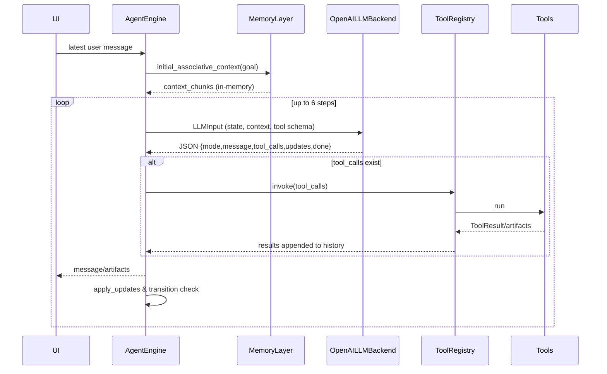
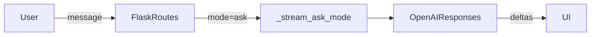

# Agent Mode and Ask Mode Analysis

## Full Agent Mode implementation
- **Entry & loop:** UI selects Agent mode, `parlanchina/routes.py` streams via `_stream_agent_engine` (`parlanchina/services/llm.py:224-263`). That builds a `ToolRegistry` from enabled internal/MCP tools, constructs an `AgentProfile` with fixed limits (6 steps, 4k tokens) and a minimal system prompt, seeds `AgentState` from the latest user message and prior chat history, and drives `AgentEngine`.
- **Orchestrator:** `AgentEngine.run` (`parlanchina/services/agent_engine.py:52-95`) pulls `initial_associative_context` once (in-memory stub), then for each step sends `LLMInput` to `OpenAILLMBackend`. It applies LLM-proposed updates (mode, scratchpad, subgoals), appends assistant/tool history, streams `message_to_user`, and stops on `done`/`mode == DONE` or step cap. There is no mid-loop refresh of context or user input.
- **LLM protocol:** `OpenAILLMBackend` (`parlanchina/services/agent_backend.py:26-91`) wraps the envelope (state, context, tool schema, goal, user_message) into a JSON schema string in the system prompt and forces `response_format={"type": "json_object"}`. Parsing is permissive; missing fields fall back to defaults and invalid JSON yields a `REVIEW`/`done=True` fallback.
- **State & types:** Protocol types live in `parlanchina/services/agent_protocol.py`. `AgentState` holds goal/subgoals/mode/step/history/scratchpad; history entries are simple role/content rows with optional `tool_call_id`. `ToolDescriptor` captures id/name/description/parameters/destructive. `LLMOutput` accepts `message` or `message_to_user` and defaults `mode` to `ACT`.
- **Tools:** `ToolRegistry` (`parlanchina/services/agent_tools.py`) exposes descriptors to the LLM and invokes runners. Internal coverage is only `internal.image`; MCP tools are proxied through `mcp_manager.call_tool_async`. There is no per-call safety check against `allow_destructive_tools`; descriptors are passed verbatim as `parameters`.
- **Memory:** `InMemoryMemoryLayer` (`parlanchina/services/agent_memory.py`) seeds context with a preloaded list (empty by default) and appends history as additional `ContextChunk`s when tools run. There is no semantic/episodic retrieval or persistence beyond the request.

## Comparison to `prompts/2025-12-05-01-AGENTS.md`
- **Protocols & types:** Spec requires explicit JSON envelopes with `ContextChunk.source` enum + score and `AgentState.metadata`; current types omit `metadata`, `score`, and typed history (`HistoryEntry` holds plain text rather than action/observation). Tool descriptors lack `side_effect_level` and JSON Schema `input_schema`/`output_schema`. No serialization helpers for `ToolInvocation/Result` beyond `to_dict`.
- **LLM I/O contract:** Spec expects strict validation and correction of malformed LLM output plus separation of `LLMInput` fields (`profile`, `state`, optional `user_input`, `context_chunks`). Implementation pushes a free-form JSON schema into the system prompt, accepts partial payloads, and defaults `mode`/ids silently. Invalid transitions downgrade to `REVIEW` without user-visible notice or recovery.
- **State machine:** The allowed transitions match the spec, but enforcement is minimal (only rejects illegal transitions; no proactive DONE or forced REVIEW on limits aside from loop cap). LLM-proposed mode drives the engine rather than an engine-owned transition function.
- **Memory:** Spec calls for associative/semantic/episodic interfaces; implementation only provides an in-memory list and does not surface memory packs or retrieval APIs.
- **Tools:** Registry does not enforce `allow_destructive_tools`, does not normalize MCP schemas, and does not expose `ToolInvocation`/`ToolResult` per the spec’s fields. Tool safety and schema validation are absent.
- **Integration:** Agent Mode is wired via `llm._stream_agent_engine`, but there is no configuration for profiles/memory packs beyond a single hard-coded profile, and Ask Mode’s existing flow was changed to strip tool access entirely (spec asked to leave Ask Mode intact).

## Ask Mode implementation
- **Path:** When mode is not `agent`, `stream_response` routes to `_stream_ask_mode` (`parlanchina/services/llm.py:89-222`). Messages are formatted and sent to the OpenAI Responses API with streaming.
- **Tools:** UI may show internal/MCP tools, but ask-mode calls always set `internal_tools`/`mcp_tools` to empty (`parlanchina/routes.py:88-121`), and `_stream_ask_mode` is invoked with `enable_image_tool=False`, so no tool schema or image generation is sent to the model.
- **Behavior:** Single-shot streaming: emits `text_delta` for output_text deltas, `text_done` on completion, and surfaces image events only if the model returns inline base64 (unlikely without tools). Errors are wrapped into `LLMEvent(type="error")`. No state machine or memory.

## Differences between Full Agent Mode and Ask Mode
- Agent Mode runs a multi-step loop with `PLAN/ACT/REVIEW/DONE`, tool orchestration, and history-aware state; Ask Mode is a single LLM turn with streaming text only.
- Agent Mode uses Chat Completions with a JSON-only response and injects tool schemas; Ask Mode uses the Responses API with no tools (even internal image generation is disabled).
- Agent Mode captures/extends history with tool calls and scratchpad in `AgentState`; Ask Mode stores only raw chat messages via `chat_store`.
- Agent Mode can emit artifacts (saved images) and chunked text via `_emit_artifacts`; Ask Mode emits only text and any incidental inline image payloads.

## Code review & quick improvements
- **Validation gaps:** `LLMOutput.from_payload` (`parlanchina/services/agent_protocol.py:172-205`) trusts payload keys; a malformed `tool_calls` or missing `tool_id` silently produces empty ids. Add schema validation and surface errors to the user/logs to avoid silent failures.
- **Mode safety:** `_apply_updates` (`parlanchina/services/agent_engine.py:95-110`) only checks transition legality; it should also enforce step cap outcomes (e.g., force `DONE` with a clear message) and avoid accepting LLM-proposed modes when `done=True` conflicts.
- **Tool safeguards:** `ToolRegistry.invoke` (`parlanchina/services/agent_tools.py:20-38`) never checks `allow_destructive_tools` or argument schemas. Add a simple guard that rejects descriptors marked `destructive` when profile disallows, and validate args against `parameters` (JSON Schema) for early feedback.
- **Message tracing:** Agent runs append a placeholder "Tool call issued" history entry and no user-visible trace of tool args. Replace with structured log entries (tool id + args summary) to help debugging and to feed back into memory/history for subsequent steps.
- **Memory usefulness:** `InMemoryMemoryLayer` (`parlanchina/services/agent_memory.py:25-38`) ignores the goal and never returns context from history until after tools execute. Seed context with prior `history` summaries or last assistant message to give the LLM minimal continuity.
- **Ask Mode parity:** `_stream_ask_mode` is hard-coded to disable the image tool (`parlanchina/services/llm.py:89-120`), so UI-advertised image generation never works. Enable the internal image tool when the user has it selected and mode is ask, or hide the toggle in UI to avoid confusion.
- **Error visibility:** Backend errors in `OpenAILLMBackend.generate` return generic text to the user but do not log the offending payload or choice content. Log the raw response (with redaction) for troubleshooting and consider sending a short recovery hint to the UI.

## Incremental remediation plan
- **Guardrails first:** Add strict JSON validation for LLM output and enforce mode transitions/step-cap handling; log and surface errors clearly. Low risk, reduces silent failures.
- **Tool safety + observability:** Enforce `allow_destructive_tools`, validate args against schemas, and write structured tool-call history entries (id + args summary). Improves safety and debuggability without refactors.
- **Ask Mode alignment:** Decide and implement consistent behavior for image generation in ask mode (enable when selected or hide the toggle); update UI copy accordingly.
- **Memory uplift:** Feed prior history snippets/last messages into `initial_associative_context` so Agent Mode has lightweight continuity; keep persistence out-of-scope for now.
- **Backend diagnostics:** Log redacted payload/response on LLM errors and return concise recovery hints to users. Helps support without altering the loop semantics.
- **Destructive defaults (optional next):** Filter MCP tools flagged destructive when profile disallows and return a clear denial message to the agent/user.

## Appendix: Testing assessment and improvements
- **Current strength:** No automated tests are present (no `tests/`, `pytest`, or `unittest` references found), so correctness relies on manual exercise via the UI.
- **Risks:** Silent regressions in the agent loop (mode transitions, tool gating), serialization shape drift for LLM envelopes, and UI stream regressions (especially image handling and error states).
- **Incremental testing plan:**
  - **Protocol unit tests:** Add `pytest`-based coverage for `agent_protocol` serialization/deserialization (AgentState/LLMInput/LLMOutput), including validation of invalid payloads and transition rejection.
  - **Engine contract tests:** Use a fake LLM backend that returns scripted `LLMOutput` sequences and a fake `ToolRegistry` to assert transitions, history updates, and stop conditions in `AgentEngine.run`.
  - **Tool registry tests:** Stub `mcp_manager`/`internal.image` to verify arg validation, destructive-tool gating, and error propagation in `ToolRegistry.invoke`.
  - **Ask/agent stream tests:** Add async tests for `_stream_ask_mode` and `_stream_agent_engine` with fake clients to assert emitted event sequences (`text_delta`, `text_done`, `image_call`, `error`).
  - **UI smoke (optional):** Run lightweight snapshot checks on rendered Markdown from `chat_store.append_assistant_message` and JS fence handling for Mermaid to catch breaking changes in message rendering.
