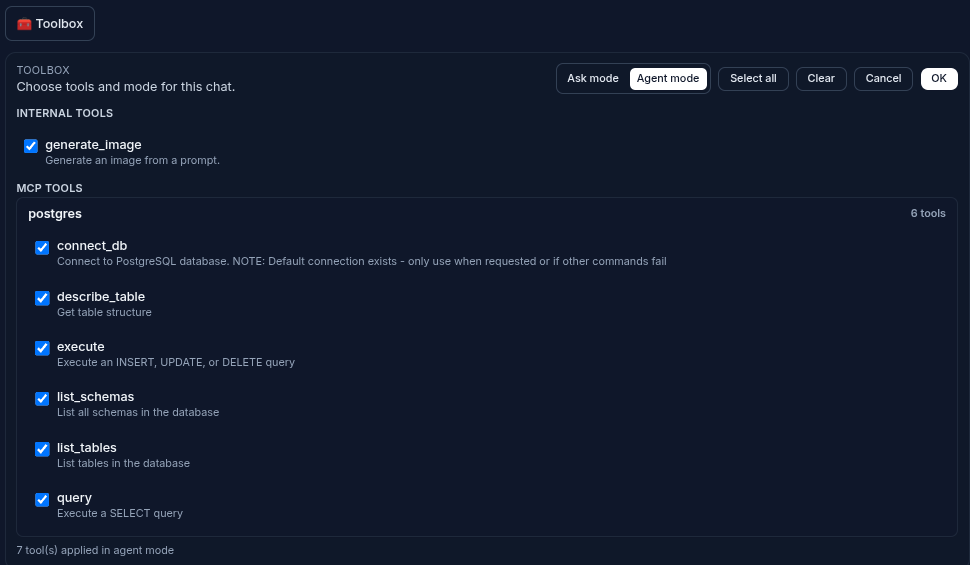

# Patina

[](LICENSE)

[](https://flask.palletsprojects.com/)

[](FOSS_PLURALISM_MANIFESTO.md)
[](https://github.com/soyrochus/patina/issues)


## Parlanchina 0.9.0 (beta)


Parlanchina is a Flask-based AI chat application you can use for real work and demos. It streams replies, renders rich content, persists sessions locally, and now ships with MCP tooling enabled by default (a PostgreSQL MCP server is preconfigured in `mcp.json`).

## Feature highlights

- **Model selection**: Pick from your configured OpenAI/Azure models per session.
- **MCP tools**: Toolbox panel with per-session tool selection; tools flow into LLM calls automatically. PostgreSQL MCP server works out of the box via the provided `mcp.json`.
- **Live streaming**: Incremental text rendering that mirrors the final saved output.
- **Markdown-first**: GitHub-flavored markdown with sanitized HTML on both client and server.
- **Mermaid diagrams**: ```mermaid blocks render with flicker-masking overlays plus zoom controls.
- **Image generation**: OpenAI Responses image tool support with generation overlays, zoom, and persisted files under `data/images/`.
- **Zoom anywhere**: Shared modal zoom for diagrams and generated images.
- **Copy helpers**: One-click copy of raw assistant text from any message bubble.
- **Keyboard flow**: Ctrl/Cmd+Enter to send; other Enter behavior remains unchanged.
- **Local persistence**: JSON session storage in `data/sessions/`; images in `data/images/`.
- **Theming**: Light/dark/system toggle; Mermaid re-renders to match the theme.
- **Session management**: Sidebar list, rename/delete, and automatic title suggestions on the first user message.
- **Safety surfacing**: Tool/image errors are shown in Markdown with a brief explanation.


## Installation

### Prerequisites

- Python 3.12 or higher
- [uv](https://docs.astral.sh/uv/) - Fast Python package installer and resolver

To install uv:

```bash
# macOS/Linux
curl -LsSf https://astral.sh/uv/install.sh | sh

# Windows (PowerShell)
powershell -ExecutionPolicy ByPass -c "irm https://astral.sh/uv/install.ps1 | iex"
```

### Get Parlanchina

Clone the repository:

```bash
git clone https://github.com/soyrochus/parlanchina.git
cd parlanchina
```

### Install dependencies

Use uv to create a virtual environment and install all dependencies:

```bash
uv sync
```

This will automatically create a `.venv` directory and install all required packages defined in `pyproject.toml`.

### Configure environment

Copy the example environment file and edit it with your API credentials:

```bash
cp .env.example .env
# Edit .env with your OPENAI_API_KEY and other settings
```

## Quickstart

Parlanchina now ships with a unified CLI: `uv run -m parlanchina [mode]`. If you omit `mode`, the desktop experience (PyWebView shell) launches by default; pass `dev` to stay in the traditional browser workflow. Helper scripts wrap the same command so you can keep muscle memory per platform.

### Desktop mode (default)

Runs the Flask server in the background and opens a native window using PyWebView.

- **macOS/Linux:**

   ```bash
   ./run_parlanchina_desktop.sh
   ```

- **Windows (PowerShell):**

   ```powershell
   .\run_parlanchina_desktop.ps1
   ```

- **Direct CLI equivalent:**

   ```bash
   uv run -m parlanchina desktop
   ```

   You can add flags such as `--root`, `--host`, `--port`, `--debug`, or `--no-debug` to customize the runtime.

### Dev/web mode (classic browser flow)

This mirrors the previous workflow where you pointed a browser at Flask directly.

- **macOS/Linux:**

   ```bash
   ./run_parlanchina_web.sh
   ```

- **Windows (PowerShell):**

   ```powershell
   .\run_parlanchina_web.ps1
   ```

- **Direct CLI equivalent:**

   ```bash
   uv run -m parlanchina dev
   ```

   When launched in dev mode, Flask runs with the reloader enabled by default, so visiting `http://127.0.0.1:5000` in your browser shows the familiar interface.

## Configuration

Parlanchina resolves settings from multiple sources (highest precedence first):

1. CLI flags such as `--root`, `--host`, `--port`, `--debug`, `--no-debug`.
2. Environment variables (including values loaded from `.env` when running in dev mode).
3. A config file at `<root>/config/settings.json` or `<root>/config/settings.yaml`.

In dev mode the project-level `.env` is loaded automatically, so you can keep secrets there while iterating locally. For desktop installs, place your configuration in `~/.parlanchina/config/settings.yaml` (or `.json`) so it travels with the desktop root. Example YAML:

```yaml
OPENAI_API_KEY: "sk-your-key"
PARLANCHINA_MODELS:
   - gpt-5.1
   - gpt-5.1-mini
PARLANCHINA_DEFAULT_MODEL: gpt-5.1-mini
LOG_LEVEL: DEBUG
```

Set the following keys via the config file or environment variables:

- `OPENAI_API_KEY` — required
- `OPENAI_PROVIDER` — `openai` (default) or `azure`
- `OPENAI_API_BASE` — custom/azure endpoint
- `OPENAI_API_VERSION` — required for Azure
- `PARLANCHINA_MODELS` — comma list of allowed models (e.g. `gpt-5.1, gpt-5,1-mini`)
- `PARLANCHINA_DEFAULT_MODEL` — picked if user does not select one
- `LOG_LEVEL` — e.g., `DEBUG`, `INFO`, `WARNING`, `ERROR`, `CRITICAL`
- `LOG_FORMAT` — e.g., `%(asctime)s %(levelname)s %(name)s: %(message)s`
- `LOG_TYPE` — `stream` (console) or `file`
- `LOG_FILE` — filename if `LOG_TYPE=file` (default: `parlanchina.log`)

Logging defaults to console (`LOG_TYPE=stream`) with a timestamped format. Raise `LOG_LEVEL` to `DEBUG` when troubleshooting MCP/tool calls or image generation; drop to `INFO`/`WARNING` for quieter runs. If you prefer log files, set `LOG_TYPE=file` and point `LOG_FILE` at your target path.

### Runtime roots: desktop vs. dev

Parlanchina keeps all writable state beneath a mode-specific root. The CLI resolves the root in this order:

1. `--root /custom/path`
2. `PARLANCHINA_ROOT=/custom/path`
3. Default per mode (see below)

| Mode      | Default root                                  | Notes |
|-----------|-----------------------------------------------|-------|
| `desktop` | `~/.parlanchina`                              | Used by the PyWebView wrapper; survives app upgrades and works well with packaged binaries. |
| `dev`     | Current working directory (the repo by default) | Mirrors the historic “run from source” behavior. |

Under whichever root is active, Parlanchina ensures these directories exist:

- `<root>/logs/app.log` — consolidated log output based on your `LOG_*` choices
- `<root>/data/` — session JSON and generated images (`data/sessions`, `data/images`)
- `<root>/config/` — user overrides such as `settings.json` or `settings.yaml`

Desktop mode additionally mirrors selected config values into environment variables at launch so LLM credentials set in `settings.json` apply without exporting them globally. In dev mode, the `.env` file in the project root remains the preferred way to store secrets.

### MCP configuration

Parlanchina connects to MCP servers via [FastMCP](https://pypi.org/project/fastmcp/). Add `fastmcp` to your environment (e.g., `uv add fastmcp`) and use the provided `mcp.json` (PostgreSQL MCP server preconfigured), or replace it with your own. The `servers` object maps server names to their config; each entry supplies `type`, `command`, `args`, and `env` for stdio transports (or `url`/`headers` for SSE):

```json
{
  "servers": {
    "postgres": {
      "type": "stdio",
      "command": "uv",
      "args": [
        "run",
        "postgres-mcp",
        "--access-mode=unrestricted"
      ],
      "env": {
        "PG_HOST": "localhost",
        "PG_PORT": "5433",
        "PG_USER": "main",
        "PG_PASSWORD": "main",
        "PG_DATABASE": "main"
      }
    }
  }
}
```

- Supported transports: `stdio` (command/args/env) and `sse` (url/headers).
- If `mcp.json` is missing or malformed, the chat UI still works and MCP controls stay disabled.
- Enable/disable tools per session via the Toolbox panel; only applied tools are exposed to the model.
- Tool calls are driven by the model and streamed back into the transcript.

### Ask mode vs. Agent mode

Parlanchina supports two execution modes:

- **Ask mode** (default): single-shot response with no automatic tool execution. The model replies directly without invoking internal or MCP tools.
- **Agent mode**: multi-step tool orchestration. Both internal and MCP tools are available (based on your Toolbox selection). The agent loops model → tool calls → model until it finishes or hits limits.



You can switch modes and select tools in the Toolbox (above the input). Only the applied selection for the current session is used in LLM calls.

## How to use (functional guide)

1. **Start a chat**  
   Launch the app, pick or accept the default model. Sessions auto-save locally as you go.

2. **Send messages**  
   - Type in the input box.  
   - `Ctrl/Cmd+Enter` to send.  
   - Enter behavior otherwise stays as-is.

3. **View streamed replies**  
   - Text streams live, then auto-saves to the session.  
   - One-click copy grabs the raw assistant text for any message.

4. **Render Markdown and Mermaid**  
   - Paste or request fenced ```mermaid blocks.  
   - A rendering overlay hides flicker/errors while diagrams finalize.  
   - Click the zoom icon on diagrams to open them in the modal.

5. **Generate images**  
   - Ask for an image; the app invokes the OpenAI image tool.  
   - While generating, an overlay and “Generating image…” label appear.  
   - Images are stored under `data/images/`, referenced as Markdown, and reload with the session.  
   - Use the zoom icon on images to view them in the modal.

6. **Switch themes**  
   - Toggle light/dark/system; Mermaid diagrams re-render to match the theme.

7. **Manage sessions**  
   - Sidebar lists conversations.  
   - Rename or delete from the menu; first user message triggers an automatic title suggestion.  
   - All chat history is kept in `data/sessions/` as JSON.

## Documentation

- Functional notes: [`doc/functional-doc.md`](doc/functional-doc.md)
- Technical notes: [`doc/technical-doc.md`](doc/technical-doc.md)


## Principles of Participation

Everyone is invited and welcome to contribute: open issues, propose pull requests, share ideas, or help improve documentation. Participation is open to all, regardless of background or viewpoint.

This project follows the [FOSS Pluralism Manifesto](./FOSS_PLURALISM_MANIFESTO.md), which affirms respect for people, freedom to critique ideas, and space for diverse perspectives.


## License and Copyright

Copyright (c) 2025, Iwan van der Kleijn

This project is licensed under the MIT License. See the [LICENSE](LICENSE) file for details.
