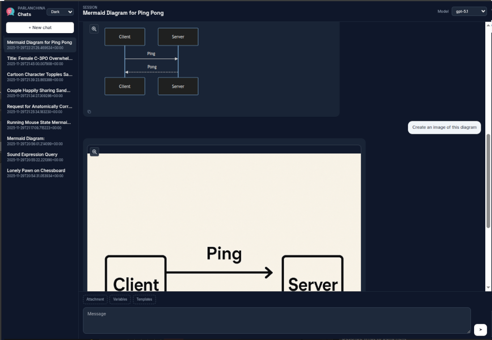

# Patina

[](LICENSE)

[](https://flask.palletsprojects.com/)

[](FOSS_PLURALISM_MANIFESTO.md)
[](https://github.com/soyrochus/patina/issues)


# Parlanchina

> Where AI conversations come to play

Minimal, demo-ready Flask chat UI that streams replies from an OpenAI-compatible backend. Single-user for now, architected to grow into multi-user later.

Parlanchina intents to bridge the gap between quick prototypes and polished demos—giving you a clean, responsive UI that works as well in stakeholder presentations as it does in your development workflow. Built for developers who need to test AI integrations without compromising on user experience, and for teams who want demos that actually look demo-worthy.

## What it Parlanchina provides

Parlanchina provides a complete chat interface with theme support, conversation management, and a responsive layout that adapts from mobile to ultrawide displays. Use it to validate your (Azure) OpenAI connections, MCP integrations, demonstrate capabilities to stakeholders, or as a foundation for your own chat applications.
No compromises between functionality and presentation.




## Quickstart

```bash
python3 -m venv .venv
. .venv/bin/activate
pip install -e .
cp .env.example .env
hypercorn parlanchina:app --bind 127.0.0.1:5000 --reload
```

## Configuration

Set these in `.env` (loaded via `python-dotenv`):

- `OPENAI_API_KEY` — required
- `OPENAI_PROVIDER` — `openai` (default) or `azure`
- `OPENAI_API_BASE` — custom/azure endpoint
- `OPENAI_API_VERSION` — required for Azure
- `PARLANCHINA_MODELS` — comma list of allowed models (e.g. `gpt-4o-mini,gpt-4o`)
- `PARLANCHINA_DEFAULT_MODEL` — picked if user does not select one

## Features

- Async Flask routes with streamed responses via ASGI (Hypercorn)
- JSON-backed chat persistence in `data/sessions/` behind a façade
- Markdown rendering (server canonical + client preview) with sanitized HTML, Mermaid-ready blocks
- Tailwind-based UI with theme toggle and model selector

## Running the app

The app uses **Hypercorn** (ASGI server) to properly support async streaming routes:

```bash
hypercorn parlanchina:app --bind 127.0.0.1:5000 --reload
```

The `--reload` flag enables auto-reload during development (like Flask's debug mode).

## Project layout

- `parlanchina/__init__.py` — app factory
- `parlanchina/routes.py` — routes + streaming endpoints
- `parlanchina/services/ai_client.py` — OpenAI/Azure streaming wrapper
- `parlanchina/services/chat_store.py` — JSON storage
- `parlanchina/utils/markdown.py` — safe Markdown → HTML
- `parlanchina/templates/` — Jinja templates
- `parlanchina/static/js/` — theme + streaming handlers
- `data/sessions/` — stored conversations

## Notes

- **ASGI required**: Flask's built-in server doesn't support async generators. Use Hypercorn or another ASGI server (uvicorn, daphne) for streaming.
- Streaming protocol: user message POSTs to `/chat/<id>`, client opens `/chat/<id>/stream`, accumulates text, then POSTs `/chat/<id>/finalize` to persist rendered HTML.
- Mermaid support: fenced ```mermaid blocks become `<pre class="mermaid">…</pre>` and are rendered on the client after streaming completes.


## Principles of Participation

Everyone is invited and welcome to contribute: open issues, propose pull requests, share ideas, or help improve documentation. Participation is open to all, regardless of background or viewpoint.

This project follows the [FOSS Pluralism Manifesto](./FOSS_PLURALISM_MANIFESTO.md), which affirms respect for people, freedom to critique ideas, and space for diverse perspectives.


## License and Copyright

Copyright (c) 2025, Iwan van der Kleijn

This project is licensed under the MIT License. See the [LICENSE](LICENSE) file for details.