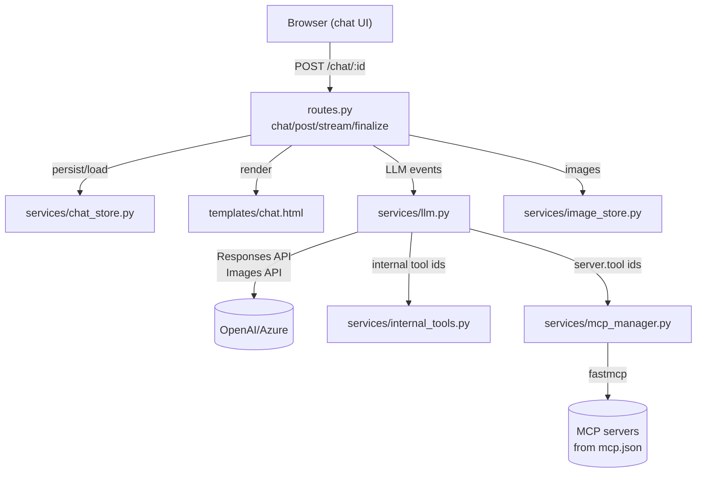
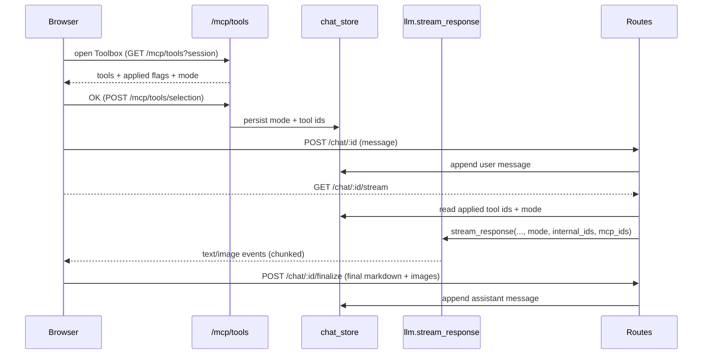

# Parlanchina – Technical Documentation

## High-level architecture
- Flask app factory in `parlanchina/__init__.py` wires blueprints, loads env, and sets data directories under `data/`.
- UI rendered via Jinja2 templates (`templates/base.html`, `templates/chat.html`) with Tailwind CDN; interactivity handled by `static/js/stream.js`, `theme.js`, and `mermaid-zoom.js`.
- Services encapsulate subsystems:
  - Session persistence (`services/chat_store.py`)
  - LLM + tool orchestration (`services/llm.py`)
  - MCP transport/discovery (`services/mcp_manager.py`)
  - Internal tools registry (`services/internal_tools.py`)
  - Image persistence/serving (`services/image_store.py`)
  - Markdown sanitization (`utils/markdown.py`)
- Blueprints: chat flows in `routes.py`; MCP tooling endpoints in `mcp_routes.py`.

## Execution modes and tool assembly (`services/llm.py`)
- `stream_response(messages, model, mode, internal_tools, mcp_tools)` routes to:
  - `_stream_ask_mode(...)`: single-shot Responses API; optional `image_generation` tool enabled when `internal.image` is applied.
  - `_stream_agent_mode(...)`: iterative loop using chat-completions with tool-calling.
- Tool payload construction:
  - `_build_agent_tool_payloads(enabled_internal_ids, enabled_mcp_ids)` merges internal + MCP tool definitions, normalizes tool names for OpenAI tool schema, and returns `(payloads, name_map)` for reverse lookup.
- Agent loop:
  - Optional planning turn prepends a brief plan to the conversation.
  - Each turn calls `client.chat.completions.create(..., tools=payloads, tool_choice="auto")`.
  - Tool calls are executed via `_run_internal_tool` or `_run_mcp_tool` (async path through `mcp_manager.call_tool_async`), then appended as `tool` messages.
  - If no final answer after tool calls, a summarization fallback synthesizes a final reply.
- Image generation in Ask mode:
  - Responses streaming events are inspected for `image_generation_call` and base64 payloads; images persisted via `image_store.save_image_from_base64`.

## Tool selection and state
- Storage fields (per session JSON): `mode` (`ask|agent`), `enabled_internal_tools`, `enabled_mcp_tools` (legacy `enabled_tools` kept in sync).
- Backend endpoints (`mcp_routes.py`):
  - `GET /mcp/tools?session_id=...` → lists internal + MCP tools with `applied` flags, current mode, MCP availability reason.
  - `POST /mcp/tools/selection` → accepts `mode`, `enabled_internal_tools`, `enabled_mcp_tools`; validates IDs (internal registry or MCP catalog) and persists to session.
- Frontend (`static/js/stream.js`):
  - `toolPanel` hidden by default; toggled by “Toolbox” button.
  - Maintains **draft** vs **applied** sets for internal and MCP tool IDs plus mode; OK posts draft, Cancel restores applied.
  - MCP tools are disabled when MCP unavailable or when mode is Ask; grouping by server with collapsible `
`.
- Chat sends no tool list; server reads applied selection for the session and injects tools inside `routes.stream_response`.

## HTTP endpoints of interest
- `GET /` → redirect to latest session or create one with default model.
- `POST /new` → create session with optional model/title.
- `GET /chat/<session_id>` → render chat UI with model options.
- `POST /chat/<session_id>` → persist user message; kicks off streaming.
- `GET /chat/<session_id>/stream` → newline-delimited JSON stream of `text_delta`, `image_start`, `image`, `error`, `text_done`.
- `POST /chat/<session_id>/finalize` → stores assistant message (`raw_markdown` + sanitized HTML + images).
- `POST /chat/<session_id>/rename`, `DELETE /chat/<session_id>`, `GET /chat/<session_id>/info` for session management.
- MCP: `GET /mcp/servers`, `GET /mcp/servers/<server>/tools`, `POST /mcp/servers/<server>/tools/<tool>` (manual run), plus toolbox endpoints above.

## Persistence (`services/chat_store.py`)
- Sessions stored as JSON: `id`, `title`, `model`, `mode`, tool selections, timestamps, `messages`.
- `messages` entries:
  - User: `{ "role": "user", "content": "<text>" }`
  - Assistant: `{ "role": "assistant", "raw_markdown": "<md>", "html": "<sanitized>", "images": [ {url, alt_text} ]? }`
- Helper API: `list_sessions`, `load_session`, `create_session`, append user/assistant messages, update title, delete session, getters/setters for mode + tool selections.
- Data directories created on startup; no DB currently.

## Rendering pipeline
- Server-side: `utils/markdown.render_markdown` uses MarkdownIt + custom fence handler for Mermaid (wraps with zoom button) and Bleach sanitization (whitelisted tags/attrs).
- Client-side streaming:
  - `static/js/stream.js` uses markdown-it + DOMPurify for interim renders while streaming; wraps Mermaid blocks and generated images with overlays/zoom controls.
  - Rendering overlay logic masks Mermaid flicker and image generation; state flags stored on `.assistant-message-wrapper`.
  - Final message replaces interim HTML with server-rendered HTML returned from `/finalize`.
- Theme switching triggers Mermaid reinitialization to match light/dark.

## LLM integration specifics
- Uses OpenAI Python SDK:
  - Responses API (`client.responses.create`) for Ask mode streaming and `complete_response`.
  - Chat Completions for agent loop tool-calling (multi-turn).
- Model selection: dropdown seeded from `PARLANCHINA_MODELS` + `PARLANCHINA_DEFAULT_MODEL`; stored per session when user posts message.
- Error handling:
  - LLM errors yield `LLMEvent(type="error")` with brief system message.
  - Image generation errors invoke a secondary `complete_response` explanation and append formatted Markdown block.
- Tool naming: `_safe_tool_name` strips non-alphanumerics, deduplicates with suffixes; reverse map ensures tool-call resolution back to IDs.

## MCP layer (`services/mcp_manager.py`)
- Reads `mcp.json` (supports map-style `servers` or legacy `mcpServers`) into `_ServerConfig`; disables MCP with explanatory reason on errors.
- Transport builder supports `stdio` (command + args/env) and `sse` (url + headers) via fastmcp transports.
- Tool discovery: `list_tools`, `list_tools_async`, `list_all_tools`; returns `server.tool` IDs + JSON schemas.
- Execution: `call_tool` / `call_tool_async` wraps fastmcp `Client.call_tool`, formats a readable result body, and serializes arbitrary result objects safely.

## Frontend interaction cues
- Toolbox: hidden by default, opened via button above input; OK/Cancel semantics ensure applied vs draft distinction.
- Input: `Ctrl/Cmd+Enter` triggers send; Enter behaviour otherwise unchanged.
- Copy: per assistant message, copies stored raw Markdown (not rendered HTML).
- Title auto-generation: background thread after first user message uses `llm.complete_response` to suggest a concise title and updates sidebar/page title.

## Data and file locations
- Sessions: `data/sessions/<session_id>.json`
- Images: `data/images/<uuid>.png`, served via `/images/<filename>`
- MCP config: `mcp.json` at project root (Postgres MCP preconfigured to `localhost:5433` by default).

## Logging and environment
- Logging configured in app factory via env: `LOG_LEVEL`, `LOG_FORMAT`, `LOG_TYPE` (`stream`|`file`), `LOG_FILE`.
- `.env` loaded by `python-dotenv`; app compatible with OpenAI or Azure endpoints based on `OPENAI_PROVIDER`, `OPENAI_API_BASE`, `OPENAI_API_VERSION`.
